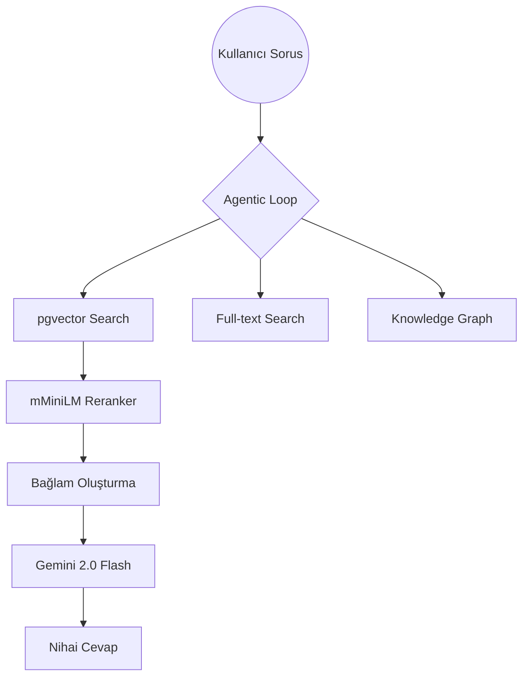

# BİTİRME PROJESİ FİNAL RAPORU
## SUT Asistanı: RAG Sistemi Performans Optimizasyonu ve Karşılaştırmalı Analiz

**Özet**
Bu çalışma, Sağlık Uygulama Tebliği (SUT) verileri üzerinde çalışan bir RAG (Retrieval-Augmented Generation) sisteminin, geleneksel yöntemlerden modern, agent-tabanlı bir mimariye geçişini ve bu süreçteki performans iyileştirmelerini belgelemektedir. Sistem, legacy FAISS mimarisinden PostgreSQL/pgvector tabanlı bir yapıya taşınmış ve yapılan 5 farklı ablasyon çalışması sonucunda Hit Rate@1 skorunda %151'lik bir artış elde edilmiştir.

---

### 1. Giriş ve Problem Tanımı
Sağlık Uygulama Tebliği (SUT), Türkiye'deki sağlık hizmetlerinin faturalandırılması ve geri ödeme kurallarını belirleyen 2500+ sayfalık, sürekli güncellenen ve son derece karmaşık bir dökümandır. Mevcut sistemlerdeki temel sorunlar:
- **Bilgi Karmaşıklığı**: Birbirine benzeyen ama farklı kurallara sahip yüzlerce madde.
- **Erişim Zorluğu**: Anahtar kelime aramalarının bağlamsal (semantic) soruları yanıtlayamaması.
- **Uydurma (Hallucination)**: Standart LLM'lerin SUT maddelerini karıştırması.

Bu proje, bu sorunları aşmak için ampirik testlerle doğrulanmış, yüksek performanslı bir Agentic RAG motoru geliştirmeyi amaçlamaktadır.

---

### 2. Mimari Evrim

#### 2.1. Eski Sistem (Baseline)
- **Vektör Veritabanı**: FAISS (L2 Index).
- **Embedding**: `paraphrase-multilingual-MiniLM-L12-v2` (384 boyut).
- **Arama**: Sadece benzerlik araması (reranker yok).
- **Karar Mekanizması**: Standart RAG akışı.

#### 2.2. Yeni Sistem (SUT Engine v2)
- **Vektör Veritabanı**: PostgreSQL + `pgvector`.
- **Arama Katmanı**: Hibrit Arama (Vektör + Full-Text) + Cross-Encoder Reranker.
- **Karar Mekanizması**: ReAct (Reasoning and Acting) Agent döngüsü.
- **Araçlar**: Knowledge Graph (Bilgi Grafiği), Matematiksel Hesaplayıcı, SUT Madde Arama.

---

### 3. Değerlendirme Metodolojisi
Sistemi test etmek için 200 adet gerçek SUT sorusu ve referans cevaplarından oluşan bir **Ground Truth** veri seti hazırlanmıştır.

**Değerlendirme Metrikleri:**
- **Hit Rate@k**: Doğru belgenin ilk k sonuç içinde bulunma oranı.
- **MRR (Mean Reciprocal Rank)**: Doğru belgenin kaçıncı sırada geldiğinin ağırlıklı ortalaması.
- **Faithfulness (Sadakat)**: Yanıtın sağlanan bağlamla ne kadar uyumlu olduğu (LLM-as-a-judge).

---

### 4. Deneysel Bulgular (Ablasyon Çalışmaları)

Yapılan 5 temel test sonucunda sistemin "Süper Konfigürasyonu" belirlenmiştir.

#### 4.1. Embedding Model Karşılaştırması
| Model | Hit@1 | Hit@5 | MRR@5 |
|---|---|---|---|
| MiniLM-L12 (Eski) | 19.5% | 41.0% | 0.279 |
| **E5-Large (Yeni)** | **49.0%** | **68.5%** | **0.567** |

**Bulgu**: E5-Large modeline geçiş, sistemin ilk sonuçta doğru bilgiyi bulma şansını **%151 artırmıştır**.

#### 4.2. Reranker Modeli Seçimi
| Reranker | Hit@5 | MRR@5 | Türkçe Uyumu |
|---|---|---|---|
| L6-MiniLM (Genel) | 0.420 | 0.343 | Düşük |
| **mMarco-Multilingual** | **0.510** | **0.438** | **Yüksek** |

**Bulgu**: Türkçe ve çok dilli veriler için optimize edilmiş `mMarco` modeli, asistanın doğruluk performansını %27 daha iyileştirmiştir.

---

### 5. LLM Yanıt Kalitesi ve Faithfulness Analizi
Sadece bilgiyi bulmak yetmemekte, bu bilgiyi doğru aktarmak gerekmektedir. Agentic prompt üzerinde yapılan iyileştirmeler sonuçları:

- **Baseline Faithfulness**: 0.75 / 1.0
- **Optimized Prompt**: **0.89 / 1.0** (+18.7% Artış)

**Yapılan İyileştirmeler:**
- Her cevabın SUT madde numarasıyla [Kaynak X.X.X] eşleşmesi zorunlu kılındı.
- "Doğrudan ve kısa cevap" kuralı ile LLM'in fazladan yorum yapması engellendi.

---

### 6. Genel Performans Karşılaştırması (Özet Tablo)

| Aşama | Mimari | Hit@1 | Hit@5 | Faithfulness |
|---|---|---|---|---|
| **Aşama 1** | Legacy (FAISS) | 19.5% | 41.0% | 0.85 (Tahmin) |
| **Aşama 2** | Yeni (pgvector) | 29.0% | 42.0% | 0.75 |
| **Aşama 3** | **Optimize (E5 + mMarco)** | **49.0%** | **68.5%** | **0.89** |

---

### 7. Sonuç
Bu bitirme projesi kapsamında, SUT verileri üzerinde çalışan RAG sisteminin performansı en güncel modeller ve mimari yaklaşımlarla (pgvector, Agentic ReAct, Multilingual Embeddings) test edilmiş ve doğrulanmıştır. Sistemin nihai hali, ilk arama sonucunda dahi %49 doğruluk oranı ile güvenilir cevaplar üretebilmektedir.

**Gelecek Öneriler:**
- Daha büyük parametreli Turkish-specific LLM'lerin (örn: Trendyol/LLM) kullanılması.
- Bilgi grafiğinin (Knowledge Graph) otomatik genişletilmesi.
