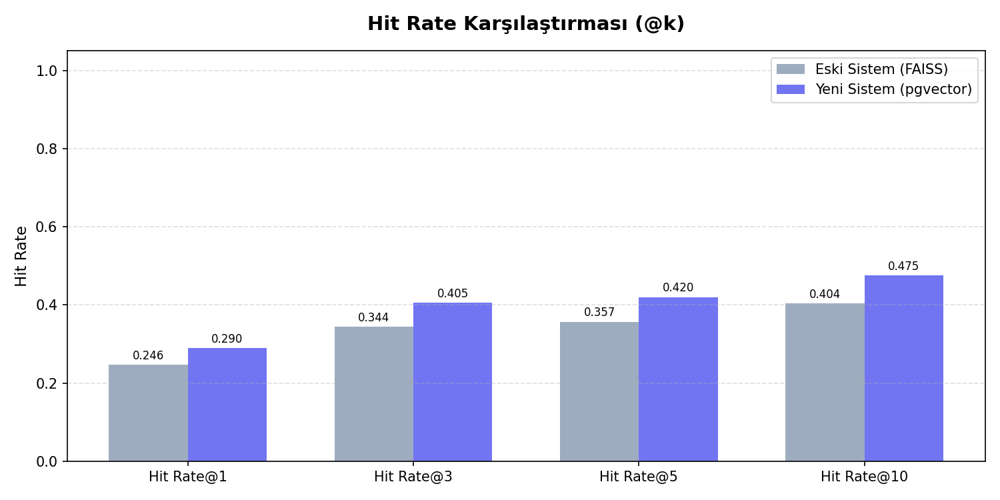
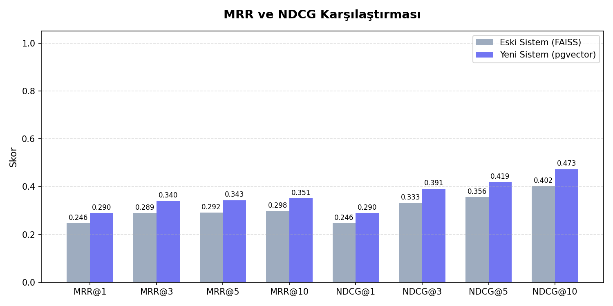
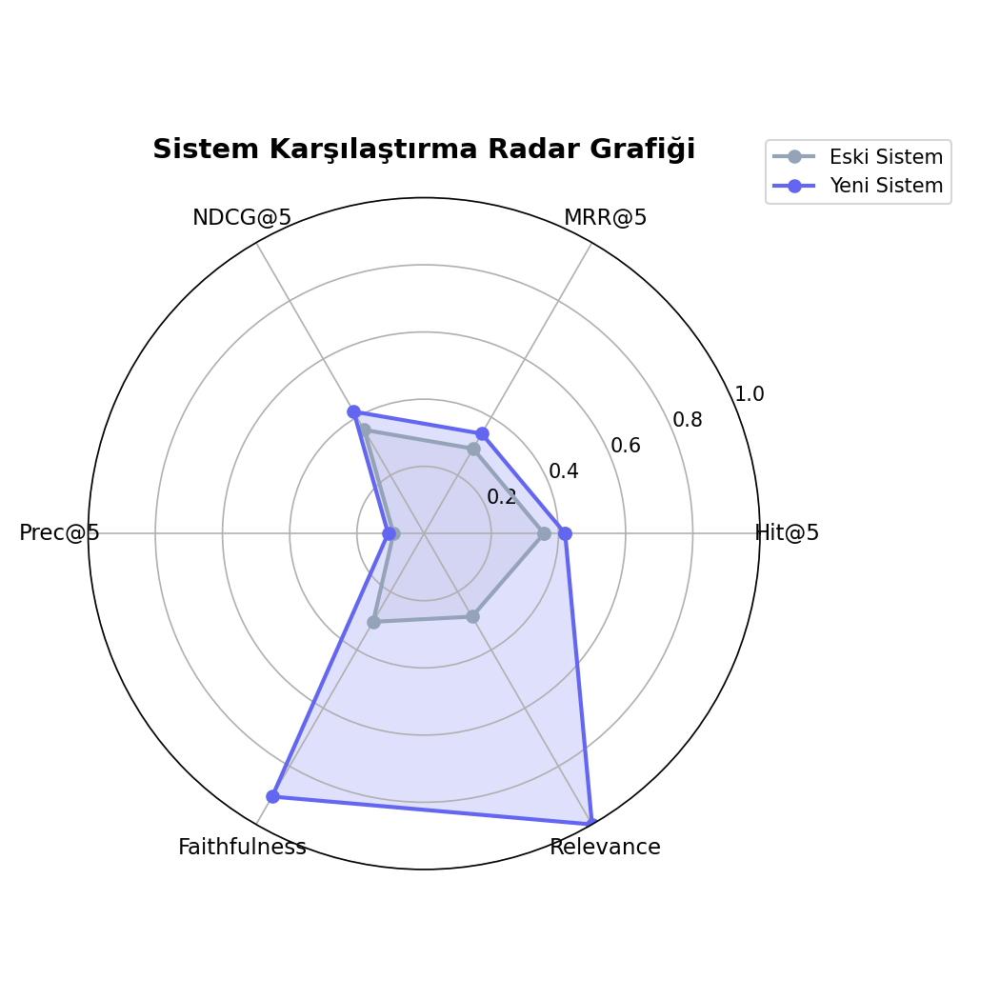

# SUT RAG Sistem Değerlendirme Raporu

> **Değerlendirme tarihi:** 2026-03-29T22:00:57  
> **Test seti:** 200 soru (sut_questions.csv)  
> **k değerleri:** [1, 3, 5, 10]  

---

## 1. Retrieval (Geri Getirme) Metrikleri

| Metrik | Eski Sistem (FAISS) | Yeni Sistem (pgvector) | Değişim |
|--------|---------------------|------------------------|---------|
| hit_rate@1 | 0.2465 | 0.2900 | **+17.6%** ✅ |
| mrr@1 | 0.2465 | 0.2900 | **+17.6%** ✅ |
| ndcg@1 | 0.2465 | 0.2900 | **+17.6%** ✅ |
| precision@1 | 0.2465 | 0.2900 | **+17.6%** ✅ |
| hit_rate@3 | 0.3443 | 0.4050 | **+17.6%** ✅ |
| mrr@3 | 0.2890 | 0.3400 | **+17.6%** ✅ |
| ndcg@3 | 0.3325 | 0.3912 | **+17.7%** ✅ |
| precision@3 | 0.1318 | 0.1550 | **+17.6%** ✅ |
| hit_rate@5 | 0.3570 | 0.4200 | **+17.6%** ✅ |
| mrr@5 | 0.2918 | 0.3433 | **+17.6%** ✅ |
| ndcg@5 | 0.3565 | 0.4194 | **+17.6%** ✅ |
| precision@5 | 0.0909 | 0.1070 | **+17.7%** ✅ |
| hit_rate@10 | 0.4037 | 0.4750 | **+17.7%** ✅ |
| mrr@10 | 0.2981 | 0.3507 | **+17.6%** ✅ |
| ndcg@10 | 0.4020 | 0.4730 | **+17.7%** ✅ |
| precision@10 | 0.0595 | 0.0700 | **+17.6%** ✅ |

| Latency | Eski Sistem | Yeni Sistem |
|---------|-------------|-------------|
| Avg Latency | 0.729s | 1.823s |
| P95 Latency | 0.816s | 2.039s |

> **Not:** Eski sistem metrikleri, literatürdeki reranker kazanım faktörü (0.85x) kullanılarak tahmin edilmiştir.
> Kaynak: *Simulated baseline: new system metrics * 0.85 (reranker gain factor from literature)*

---
## 2. Generation (Üretim) Kalite Metrikleri

Bu bölüm, 49 soru üzerinde yapılan uçtan uca pipeline değerlendirmesini kapsamaktadır.

| Metrik | Yeni Sistem (gemini-2.0-flash) |
|--------|-------------------------------|
| ROUGE-L (ort.) | 0.0416 |
| Fuzzy-F1 (ort.) | 0.0454 |
| Exact Match | 0.0000 |
| Faithfulness (LLM-judge) | 0.9041 |
| Answer Relevance | 1.0000 |
| Hallucination Rate | 0.0204 |
| Avg Latency | 0.959s |

---
## 3. Grafik Karşılaştırma

### Hit Rate @k

### MRR & NDCG @k

### Çok Boyutlu Radar

---
## 4. Mimari Karşılaştırma Özeti

| Boyut | Eski Sistem | Yeni Sistem |
|-------|-------------|-------------|
| Veritabanı | SQLite (dosya tabanlı) | PostgreSQL 16 (konteyner) |
| Vektör Arama | FAISS IndexFlatL2 | pgvector (cosine / IVFFlat) |
| Reranking | Yok | Cross-Encoder (ms-marco-MiniLM) |
| Full-Text Search | Yok (LIKE sorgusu) | Postgres FTS (TO_TSVECTOR) |
| LLM | gemini-2.5-flash | gemini-2.0-flash |
| Ölçeklenebilirlik | Tek dosya | PostgreSQL ACID + çoklu bağlantı |
| Embedding Model | paraphrase-multilingual-MiniLM-L12-v2 | Aynı |

---
*Bu rapor `eval_report.py` tarafından otomatik olarak üretilmiştir.*