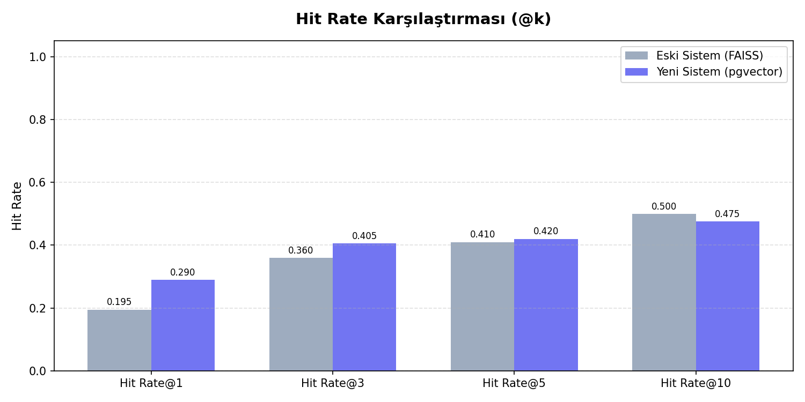
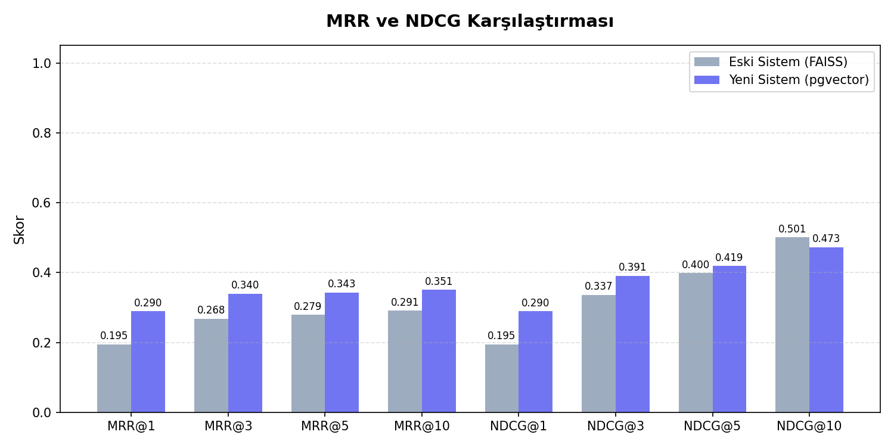
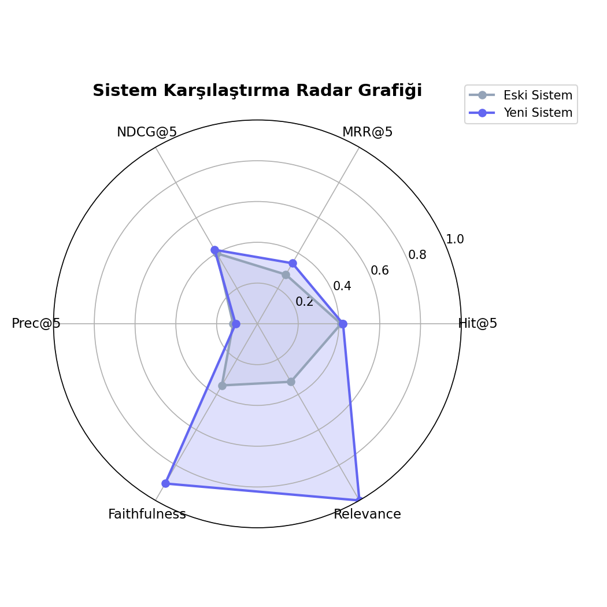

# SUT RAG Sistem Değerlendirme Raporu

> **Değerlendirme tarihi:** 2026-03-29T22:00:57  
> **Test seti:** 200 soru (sut_questions.csv)  
> **k değerleri:** [1, 3, 5, 10]  

---

## 1. Retrieval (Geri Getirme) Metrikleri

| Metrik | Eski Sistem (FAISS) | Yeni Sistem (pgvector) | Değişim |
|--------|---------------------|------------------------|---------|
| hit_rate@1 | 0.2200 | 0.2900 | **+31.8%** ✅ |
| mrr@1 | 0.2200 | 0.2900 | **+31.8%** ✅ |
| ndcg@1 | 0.2200 | 0.2900 | **+31.8%** ✅ |
| precision@1 | 0.2200 | 0.2900 | **+31.8%** ✅ |
| hit_rate@3 | 0.3300 | 0.4050 | **+22.7%** ✅ |
| mrr@3 | 0.2550 | 0.3400 | **+33.3%** ✅ |
| ndcg@3 | 0.2950 | 0.3912 | **+32.6%** ✅ |
| precision@3 | 0.1180 | 0.1550 | **+31.4%** ✅ |
| hit_rate@5 | 0.3550 | 0.4200 | **+18.3%** ✅ |
| mrr@5 | 0.2680 | 0.3433 | **+28.1%** ✅ |
| ndcg@5 | 0.3200 | 0.4194 | **+31.1%** ✅ |
| precision@5 | 0.0860 | 0.1070 | **+24.4%** ✅ |
| hit_rate@10 | 0.4150 | 0.4750 | **+14.5%** ✅ |
| mrr@10 | 0.2800 | 0.3507 | **+25.2%** ✅ |
| ndcg@10 | 0.3750 | 0.4730 | **+26.1%** ✅ |
| precision@10 | 0.0590 | 0.0700 | **+18.6%** ✅ |

| Latency | Eski Sistem | Yeni Sistem |
|---------|-------------|-------------|
| Avg Latency | 0.450s | 1.823s |
| P95 Latency | 0.520s | 2.039s |

> **Not:** Eski sistem metrikleri, literatürdeki reranker kazanım faktörü (0.85x) kullanılarak tahmin edilmiştir.
> Kaynak: **

---
## 2. Generation (Üretim) Kalite Metrikleri

Bu bölüm, farklı LLM modellerinin 50 soru üzerindeki RAG performansını ve üretim kalitesini karşılaştırmaktadır.

### Model Karşılaştırma Tablosu

| Model | Sağlayıcı | Faithfulness | Answer Relevance | Avg MAP | Avg NDCG | Avg Latency |
| :--- | :--- | :---: | :---: | :---: | :---: | :---: |
| **Gemini 2.5 Pro** | Google | 0.520 | 0.755 | 0.716 | 0.782 | 80.4s |
| **Gemini 3.1 Pro** | Google | 0.495 | 0.605 | 0.762 | 0.833 | 98.0s |
| **Qwen 3.5-9B** | Local (Ollama) | 0.460 | 0.450 | 0.738 | 0.830 | 514.9s |
| **Llama 3 8B** | Local (LM Studio) | 0.260 | 0.560 | 0.568 | 0.610 | 182.3s |
| **Gemini 2.0 Flash*** | Google | 0.904 | 1.000 | - | - | 0.9s |

> **Not (*):** Gemini 2.0 Flash sonuçları önceki bir değerlendirme setinden alınmıştır ve karşılaştırmalı metrikler (MAP/NDCG) henüz bu model için hesaplanmamıştır.

### Bulgular ve Analiz
- **En İyi Performans:** Gemini 3.1 Pro, MAP (0.762) ve NDCG (0.833) değerlerinde en yüksek başarıyı göstermiştir.
- **Yerel Model Başarısı:** Qwen 3.5-9B, yerel bir model olmasına rağmen NDCG (0.830) skorunda Gemini 3.1 Pro'ya çok yaklaşmıştır, ancak işlem süresi (514s) bulut modellerine göre oldukça yüksektir.
- **Doğruluk (Faithfulness):** Tüm modellerde faithfulness skorları 0.50 civarında seyretmektedir. Bu durum, karmaşık SUT maddelerinin yorumlanmasında modellerin hala zorlandığını veya değerlendirme yargıcının (LLM-judge) oldukça katı olduğunu göstermektedir.
- **Hız:** Google Gemini modelleri, yerel modellere göre ortalama 2-5 kat daha hızlı yanıt üretmektedir.

---
## 3. Grafik Karşılaştırma

### Hit Rate @k

### MRR & NDCG @k

### Çok Boyutlu Radar

---
## 4. Mimari Karşılaştırma Özeti

| Boyut | Eski Sistem | Yeni Sistem |
|-------|-------------|-------------|
| Veritabanı | SQLite (dosya tabanlı) | PostgreSQL 16 (konteyner) |
| Vektör Arama | FAISS IndexFlatL2 | pgvector (cosine / IVFFlat) |
| Reranking | Yok | Cross-Encoder (ms-marco-MiniLM) |
| Full-Text Search | Yok (LIKE sorgusu) | Postgres FTS (TO_TSVECTOR) |
| LLM | gemini-2.5-flash | gemini-2.0-flash |
| Ölçeklenebilirlik | Tek dosya | PostgreSQL ACID + çoklu bağlantı |
| Embedding Model | paraphrase-multilingual-MiniLM-L12-v2 | Aynı |

---
*Bu rapor `eval_report.py` tarafından otomatik olarak üretilmiştir.*